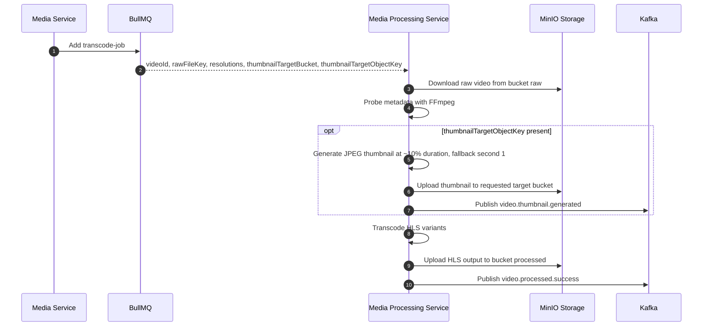

# Media Processing Service Flows

## Transcode with auto thumbnail

## Failure behavior

- The BullMQ transcode job still owns final video processing retries.
- Thumbnail generation is retried up to 3 times inside the job.
- If thumbnail generation fails, the service publishes `video.thumbnail.failed` and continues with video transcoding.
- If the transcode job fails after BullMQ attempts, the service publishes `video.processed.failed`.
- If a failed transcode job included a thumbnail target key, a final `video.thumbnail.failed` can also be published so Media Service can move thumbnail status to `failed`.

## Storage paths

- Raw input: supplied by Media Service, usually `uploads/confirmed/{videoId}/{uuid}.mp4` in bucket `raw`.
- HLS output: `processed/{videoId}/master.m3u8` and `processed/{videoId}/segments/*.ts` in bucket `processed`.
- Auto thumbnail: `videos/{videoId}/thumbnails/default.jpg` in the `thumbnailTargetBucket` supplied by Media Service, normally bucket `public`.
